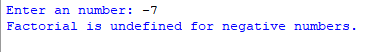

## Description
The factorial of a number N is the product of all positive integers from 1 to N.  
This  program calculates factorials for user-entered numbers, providing clear messages for various input scenarios, including zero, negative, and very large numbers (above 170). It's beginner-friendly and does not utilize functions.  
However, please note that it does not handle non-integer inputs.  
## Example
♡ Example 1    
  
♡ Example 2  
  
♡ Example 3  
  
♡ Example 4  

